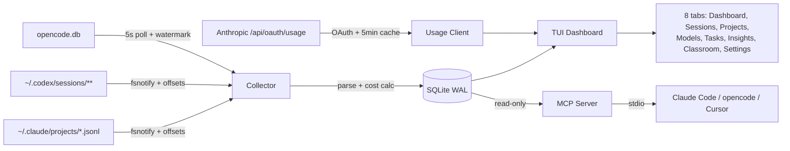
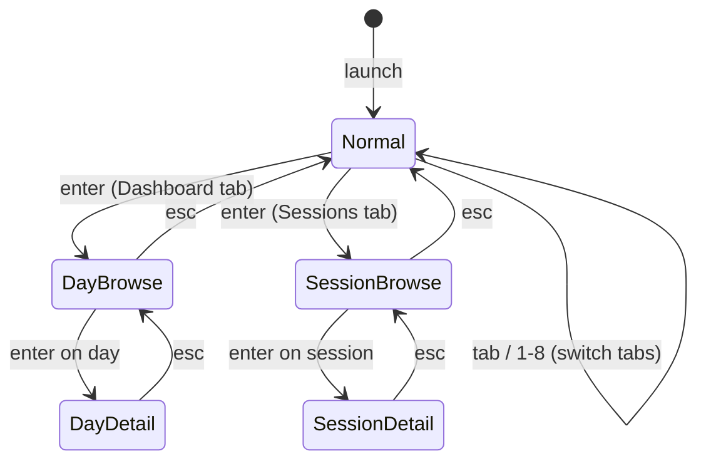
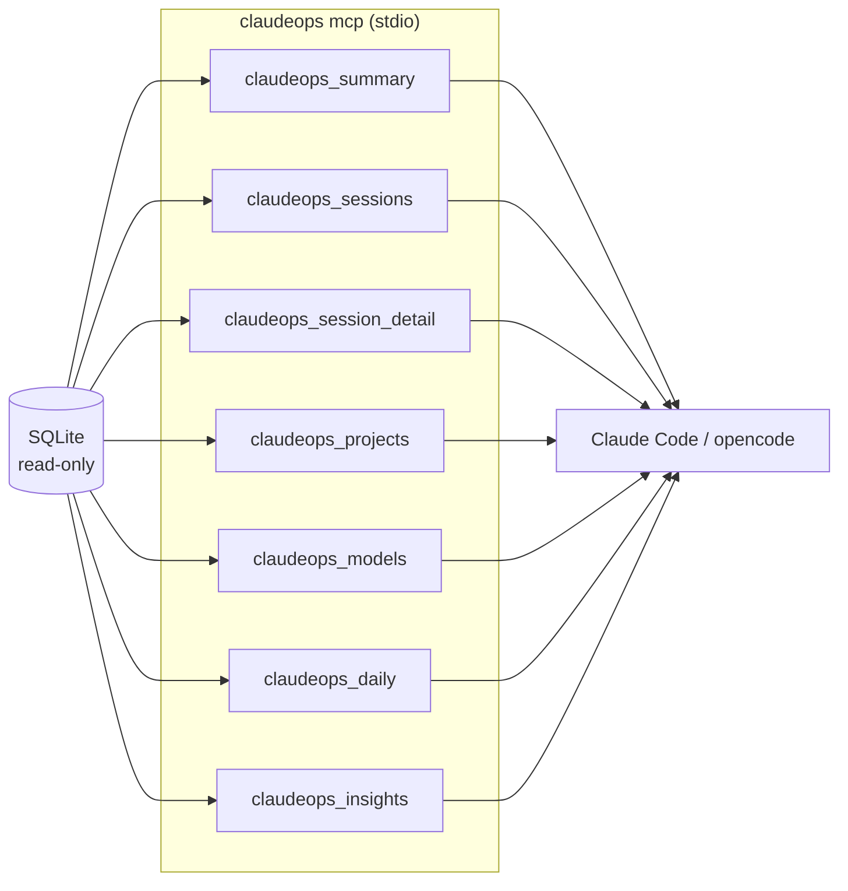
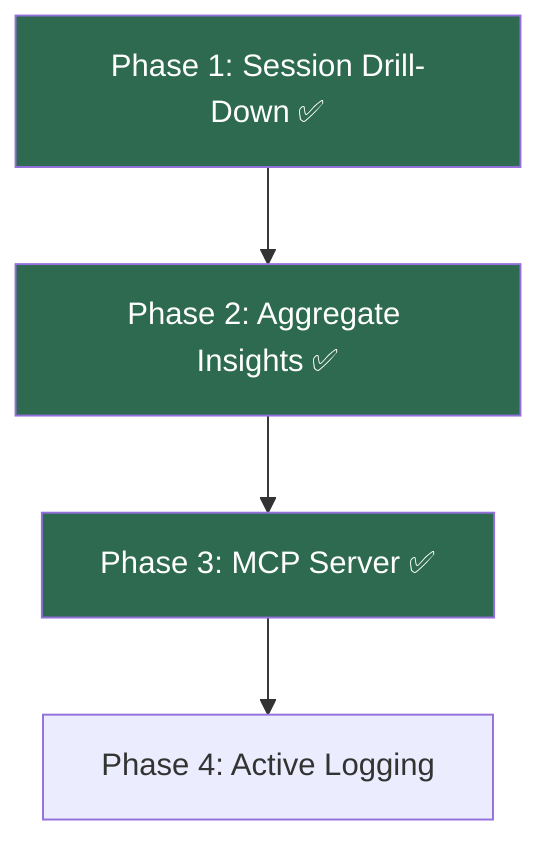

# claudeops-tui

Local TUI to track Claude Code usage, costs, and tasks. Single binary, no daemon, no SaaS.

Shows **real** subscription % from Anthropic's `/api/oauth/usage` endpoint — not estimates against guessed plan limits like every other tool out there.

## What it does

- Parses `~/.claude/projects/*.jsonl` incrementally (fsnotify + persisted byte offsets)
- Also ingests **Codex** rollouts (`~/.codex/sessions`) and **opencode**'s SQLite database when they are present, auto-detected on first run
- Stores events in local SQLite (`modernc.org/sqlite`, no CGO)
- Computes per-event cost in € using a **four-class** token breakdown (input, output, cache_read, cache_create) — collapsing them ruins the math
- Calls Anthropic's undocumented `GET /api/oauth/usage` for the real session/weekly/per-model usage that Claude Code's own `/usage` command uses, with OAuth token refresh
- Tracks live quota for other services too (Codex, Copilot, Gemini, plus your own HTTP providers) — see [`docs/providers.md`](./docs/providers.md)
- Tracks tasks via `claudeops task start "name"` and attributes every event ingested while the task is active to it (time-window based, across all sessions — see [`docs/limitations.md`](./docs/limitations.md))
- **Session drill-down** — navigate into any session to see per-model costs, hourly activity, token breakdown with cache hit ratio, and duration
- **Daily drill-down** — browse daily aggregates with hourly charts and per-model breakdown
- **Insights engine** — 5 computed insights: cache efficiency, model mix, cost trend, session efficiency, peak hours
- **Classroom** — a live grid of your currently-running Claude Code sessions, working or waiting for input
- **MCP server** — expose all data to Claude Code, opencode, or any MCP client for conversational analysis
- **OTLP export** — push your metrics to an OpenTelemetry endpoint, and manage Claude Code's own OTel env vars
- Renders one consolidated Bubbletea dashboard with 8 tabs

## Architecture



### Navigation flow



## Install

```bash
go install github.com/fullfran/claudeops-tui/cmd/claudeops@latest
```

### Update

Preferred path when `claudeops` was installed with `go install`:

```bash
claudeops update
```

If automatic update is not safe for your installation, the command fails with a clear reason and prints the manual command.

Manual update remains:

```bash
go install github.com/fullfran/claudeops-tui/cmd/claudeops@latest
```

If the Go proxy is still serving the previous commit for a few minutes, retry with:

```bash
GOPROXY=direct go install github.com/fullfran/claudeops-tui/cmd/claudeops@latest
```

If `claudeops` is still "command not found" after installation, your Go bin directory is probably not on `PATH` yet:

```bash
export PATH="$(go env GOPATH)/bin:$PATH"
```

Add that line to your shell config (`~/.bashrc`, `~/.zshrc`, etc.), reload the shell, and verify:

```bash
which claudeops
claudeops version
```

Or build locally:

```bash
git clone https://github.com/fullfran/claudeops-tui
cd claudeops-tui
CGO_ENABLED=0 go build -o claudeops ./cmd/claudeops
./claudeops
```

**Upgrading from an earlier version?** Read [`docs/upgrading.md`](./docs/upgrading.md) — `CODEX_HOME` semantics changed and Codex users should re-ingest.

## Usage

```bash
claudeops                        # launch the TUI dashboard (default)
claudeops mcp                    # start MCP server (stdio, for Claude Code / opencode)
claudeops task start "refactor parser"
claudeops task stop
claudeops task list
claudeops ingest                 # one-shot ingest of existing source files
claudeops reingest [--yes]       # rebuild the event store from source files
claudeops update                 # update the installed CLI when safe
claudeops hooks install          # register Claude Code hooks for live session state
claudeops hooks uninstall        # remove claudeops hooks from settings.json
claudeops hooks status           # show which hooks are registered
claudeops hooks handle           # handle a hook event on stdin (invoked by Claude Code)
claudeops push [--dry-run] [--since RFC3339]   # push metrics to an OTLP endpoint
claudeops otel-config apply      # write Claude Code OTel env vars to settings.json
claudeops otel-config status     # show the OTel telemetry configuration
claudeops otel-config remove     # remove the OTel telemetry configuration
claudeops version
claudeops help
```

`reingest` clears the derived event store (events, sessions, projects, offsets,
watermarks) and rebuilds it from the source files. Tasks and config are kept. It
asks for confirmation unless you pass `--yes`.

### Live session state (`hooks`)

`claudeops hooks install` registers claudeops for Claude Code's `SessionStart`,
`UserPromptSubmit`, `Stop` and `SessionEnd` events in `~/.claude/settings.json`.
Each event writes a small sidecar into `~/.claudeops/live/`, which the
**Classroom** tab uses to show whether a session is working or waiting for you.
Without the hooks, Classroom still works but falls back to a file-mtime
heuristic, which cannot tell "waiting for input" from "just finished".

### OTLP export (`push`, `otel-config`)

`claudeops push` sends aggregated metrics to the OTLP HTTP endpoint configured
under `[export]` in `config.toml`. Use `--dry-run` to print the payload instead
of sending it, and `--since` to override the window start.

`claudeops otel-config apply` writes Claude Code's own telemetry env vars
(`CLAUDE_CODE_ENABLE_TELEMETRY`, `OTEL_*`) into `~/.claude/settings.json` so
Claude Code exports directly to the same endpoint; `status` shows them and
`remove` deletes only the keys claudeops manages. `apply` requires
`[export.claude_otel] enabled = true`.

### Keyboard shortcuts

Press `?` inside the TUI for the full keybinding reference. Highlights:

| Key | Action |
|-----|--------|
| `1`–`8` | switch tab (Dashboard, Sessions, Projects, Models, Tasks, Insights, Classroom, Settings) |
| `tab` / `shift+tab`, `h` / `l`, `←` / `→` | cycle tabs |
| `enter` | browse daily breakdown (Dashboard) / browse sessions (Sessions) / drill into detail |
| `j` / `k`, `↑` / `↓` | navigate lists (day browser, session browser, settings) / scroll |
| `p` | switch subscription focus on the Dashboard (All / Claude / Codex / …) |
| `space` | toggle setting (Settings tab) |
| `enter` (Settings) | toggle a bool, edit a string inline, or run a `►` action |
| `esc` | go back one level (detail → browse → tab) |
| `n` / `S` | new task / stop task |
| `r` | force refresh |
| `?` | help overlay |
| `q` | quit (goes back one level inside drill-downs) |

### Session drill-down

From the **Sessions** tab, press `enter` to open the session browser. Use `j`/`k` to navigate sessions — a preview card shows cost, events, tokens, and duration. Press `enter` again to see the full detail view:

- **Per-model cost breakdown** with percentage of total
- **Hourly activity chart** showing when cost was incurred
- **Token breakdown** — input, output, cache read, cache create
- **Cache hit ratio** — how effectively the session used prompt caching
- **Duration** — first to last event timestamps

### Insights tab

Press `6` to see computed insights about your usage patterns:

| Insight | What it detects | Severity |
|---------|----------------|----------|
| **Cache Efficiency** | Low prompt cache reuse across sessions | Warn <20%, Tip 20-40% |
| **Model Mix** | Over-reliance on a single (expensive) model | Tip if >70% on one model |
| **Cost Trend** | Week-over-week spending changes | Warn if >50% increase |
| **Session Efficiency** | Short sessions costing more per token (cold context rebuilds) | Tip if 2x+ more expensive |
| **Peak Hours** | When you spend the most | Info (top 3 hours) |

Each insight is toggleable in the Settings tab (`8`).

### Classroom tab

Press `7` for a live grid of your currently-running Claude Code sessions — one
"desk" per session, refreshed on the 2s tick:

- ✨ **working** — the session is producing output
- 💤 **waiting** — the session is waiting for your input

Sessions are discovered from `~/.claude/projects` file activity. Install the
hooks (`claudeops hooks install`) for accurate state; without them the state is
inferred from file mtimes alone.

### MCP server

The MCP server exposes your usage data to **Claude Code**, **opencode**, **Cursor**, or any MCP-compatible client. This lets you ask questions about your usage conversationally:

> *"What project am I spending the most on this week?"*
> *"Am I using cache effectively?"*
> *"Show me my daily cost trend for the last month"*



#### Activate

```bash
# Register the MCP server with Claude Code
claude mcp add claudeops -- claudeops mcp
```

This tells Claude Code to launch `claudeops mcp` on demand. The server opens your SQLite database in **read-only mode** (safe to run alongside the TUI), answers queries via stdio, and exits when the connection closes. Zero background processes.

The **Settings** tab shows whether `claudeops` is currently registered in
`~/.claude.json`. It only reads that file — registration stays your call.

#### Deactivate

```bash
# Remove it — no more context token cost
claude mcp remove claudeops
```

When deactivated, the 7 tools disappear from Claude's context completely. **Activate it only when you want to analyze your usage**, then deactivate to save context tokens.

#### Available tools

| Tool | Description | Params |
|------|-------------|--------|
| `claudeops_summary` | Cost and token aggregates | `period`: today, 7d, 30d (required) |
| `claudeops_sessions` | Sessions ranked by cost | `limit`: 1-100 (default 20) |
| `claudeops_session_detail` | Full session breakdown (models + hourly) | `session_id` (required) |
| `claudeops_projects` | Projects ranked by cost | `limit`: 1-100 (default 20) |
| `claudeops_models` | Per-model usage with cache ratios | none |
| `claudeops_daily` | Daily cost/events trend | `days`: 1-90 (default 30) |
| `claudeops_insights` | Computed insights from the Insights tab | none |

#### opencode

Add to `~/.config/opencode/opencode.json` inside the `"mcp"` object:

```json
{
  "mcp": {
    "claudeops": {
      "type": "local",
      "command": ["claudeops", "mcp"],
      "enabled": true
    }
  }
}
```

Set `"enabled": false` to deactivate without removing the entry.

#### Cursor / other MCP clients

Add to your MCP config file (e.g. `~/.cursor/mcp.json`):

```json
{
  "mcpServers": {
    "claudeops": {
      "command": "claudeops",
      "args": ["mcp"]
    }
  }
}
```

Remove the entry to deactivate.

## Files

| Path | Purpose |
|---|---|
| `~/.claudeops/claudeops.db` | local SQLite store (WAL mode) |
| `~/.claudeops/pricing.toml` | editable price table (seed shipped, edit when Anthropic changes prices) |
| `~/.claudeops/config.toml` | dashboard widgets, thresholds, tab visibility, usage polling interval, export settings (auto-created on first run) |
| `~/.claudeops/providers.toml` | optional user-defined quota providers (see [`docs/providers.md`](./docs/providers.md)) |
| `~/.claudeops/current-task.json` | sidecar for the active task |
| `~/.claudeops/live/` | hook-written live session sidecars (Classroom tab) |
| `~/.claude/projects/*.jsonl` | source data — read only |
| `~/.codex/sessions/**/*.jsonl` | Codex source data — read only (override the parent dir with `CODEX_HOME`) |
| `~/.local/share/opencode/opencode.db` | opencode source data — read only |
| `~/.claude/.credentials.json` | OAuth tokens — read always, written only during token refresh, atomic + 0600; locking uses the sidecar `.credentials.json.lock` |
| `~/.claude/settings.json` | Claude Code settings — claudeops manages only its hook entries and OTel env vars |

## Configuration

`~/.claudeops/config.toml` is auto-created on first run. Every field falls back
to its built-in default when missing, so you can delete anything you do not
want to pin.

```toml
[dashboard]
show_subscription = true      # subscription % bars
show_today = true             # today's events / cost / tokens
show_top_sessions = true      # highest-cost sessions (7d)
show_top_projects = true      # highest-cost projects (7d)
show_active_task = true       # current task name + elapsed
show_sparkline_14d = true     # daily cost bar chart
show_per_model_today = true   # today's cost by model
show_burn_rate = true         # cost/hour from the last 4h
show_streak = true            # consecutive active days
show_avg_per_session = true   # today's average cost per session
show_cache_hit_ratio = true   # cache efficiency, inline on the Today card
show_tokens_per_euro = true   # inline on the Today card
show_max_day_30d = true       # most expensive day in 30d
show_vs_avg_7d = true         # daily spend vs the 7d average

[dashboard.thresholds]
daily_warn_eur = 20           # yellow threshold
daily_alert_eur = 50          # red threshold

[usage]
cache_ttl_seconds = 300       # how often to poll Anthropic's usage endpoint (default: 5min)

[tabs]                        # hide whole tabs; Dashboard, Classroom and
sessions = true               # Settings are always visible
projects = true
models = true
tasks = true
insights = true

[insights]
show_cache_efficiency = true
show_model_mix = true
show_cost_trend = true
show_session_efficiency = true
show_peak_hours = true

[keybindings]
command_palette = "ctrl+p"

[export]
enabled = false               # push metrics to an OTLP endpoint
user_name = ""                # your display name in dashboards
team_name = ""                # team label for grouping
endpoint = ""                 # OTLP HTTP endpoint URL (required when enabled)

[export.headers]              # extra headers sent with the push, e.g.
# Authorization = "Bearer …"

[export.claude_otel]
enabled = false               # manage Claude Code's own OTel env vars
include_user_prompts = false  # log user prompt content
include_tool_details = false  # log Bash commands and file paths

# Optional: pin the ingestion sources instead of auto-detecting them.
# An explicit [[sources]] list always wins.
[[sources]]
name = "claude"               # "claude" | "codex" | "opencode"
enabled = true
root = ""                     # empty uses the per-source default path
format = "jsonl"              # informational
```

Two keys are written by the config encoder but currently have no effect:
`[tabs] calendar` and the whole `[calendar]` section. The calendar tab was never
shipped — the 7th tab is Classroom. Leave them alone or delete them.

## Roadmap

See [epic #9](https://github.com/FullFran/claudeops-tui/issues/9) for the work pattern analysis roadmap:



| Phase | Status | What |
|-------|--------|------|
| **1. Session Drill-Down** | Done | Navigate into sessions, see per-model costs, hourly charts, cache ratios |
| **2. Aggregate Insights** | Done | Cache efficiency, model mix, cost trend, session efficiency, peak hours |
| **3. MCP Server** | Done | 7 tools via `claudeops mcp` for conversational usage analysis |
| **4. Active Logging** | Partial | Hooks + Classroom track live session state; intent tagging and tool usage patterns are not implemented |

## Status

0.7.0. Multi-source ingestion (Claude, Codex, opencode), interactive
drill-downs, computed insights, live Classroom, MCP server, and OTLP export.

## Caveats

- The `/api/oauth/usage` endpoint is **undocumented**. Anthropic can change or remove it without notice. ClaudeOps degrades gracefully ("subscription % unavailable") instead of faking numbers.
- Pricing in TOML goes stale when Anthropic updates prices. Edit `~/.claudeops/pricing.toml`.
- The collector lives inside the TUI process. If the TUI is closed, live ingestion pauses — run `claudeops ingest` (e.g. from cron) to catch up without opening the dashboard. There is no daemon mode.

## Documentation

- [`docs/architecture.md`](./docs/architecture.md) — package map, data flow, decisions
- [`docs/upgrading.md`](./docs/upgrading.md) — behavior changes that need action from you
- [`docs/providers.md`](./docs/providers.md) — built-in and user-defined quota providers
- [`docs/jsonl-format.md`](./docs/jsonl-format.md) — observed Claude Code and Codex event shapes
- [`docs/oauth-usage-endpoint.md`](./docs/oauth-usage-endpoint.md) — endpoint reference
- [`docs/limitations.md`](./docs/limitations.md) — what's broken, fragile, or missing
- [`docs/plan.md`](./docs/plan.md) — original vision and phasing (historical)

## License

MIT.
